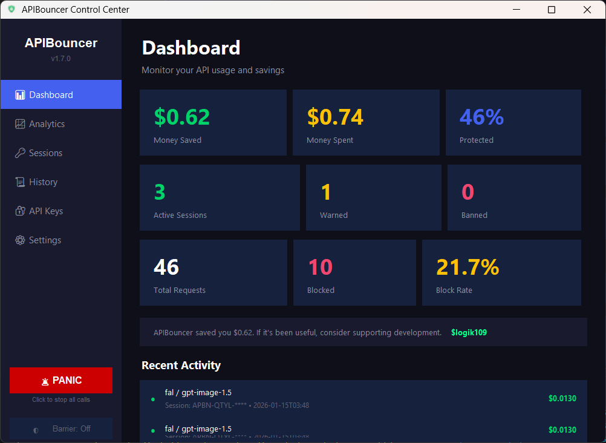
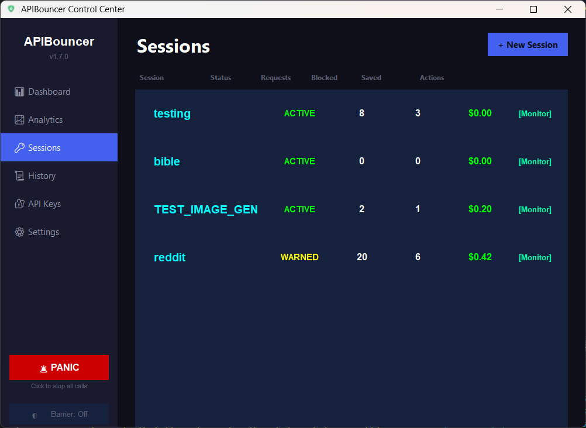
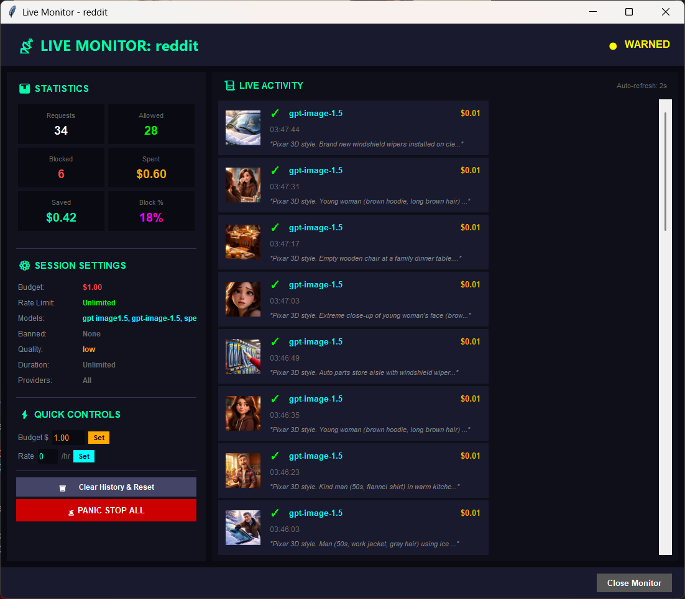
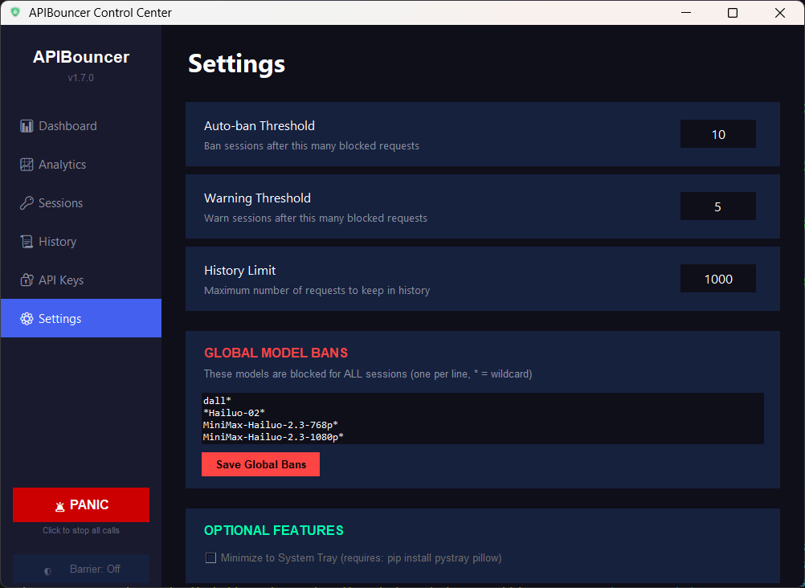

# APIBouncer

Protect your API keys from AI agents. Control what models, quality, and budgets are allowed.



## Quick Start

**Download [APIBouncer.exe](https://github.com/logik1092/apibouncer/releases) → Add your API keys → Create a session → Done.**

That's it. Your AI gets a session ID, you control what's allowed.

---

## Features

### Session Management
Create isolated sessions for different projects. Each session has its own budget, model whitelist, and rate limits.



### Live Monitoring
Watch API calls in real-time. See what your AI is generating, costs per request, and block suspicious activity instantly.



### Global Controls
Set auto-ban thresholds, global model bans (with wildcard support), and optional barrier mode for manual approval of every request.



---

## From Source

```bash
git clone https://github.com/logik1092/apibouncer.git
cd apibouncer
pip install -r requirements.txt
python apibouncer_gui.pyw
```

---

## What It Does

Your AI calls the proxy instead of the API directly:

```python
from apibouncer import openai

result = openai.image(
    session_id="APBN-XXXX-XXXX",
    prompt="A sunset",
    model="gpt-image-1.5",
    quality="low"
)
```

You control:
- **Models** - Whitelist only what you approve
- **Quality** - Force "low" to save 10x
- **Budget** - Hard spending cap per session
- **Rate limits** - Prevent runaway scripts
- **Panic button** - Block everything instantly
- **Barrier mode** - Require manual approval for every API call

## Supported Providers

**Built-in:**
- OpenAI (GPT-Image-1.5, DALL-E, GPT-4o)
- fal.ai (Flux models, cheaper GPT-Image-1.5)
- MiniMax (Video generation, TTS)

**Add your own:** See `examples/add_provider.py` - just inherit from `BaseProvider` and write your API call.

---

## Security

API keys are stored locally using encrypted storage with machine-specific keys. Your keys never leave your machine.

---

## Support

If APIBouncer saved you money: [$logik109](https://cash.app/$logik109)

## License

MIT
